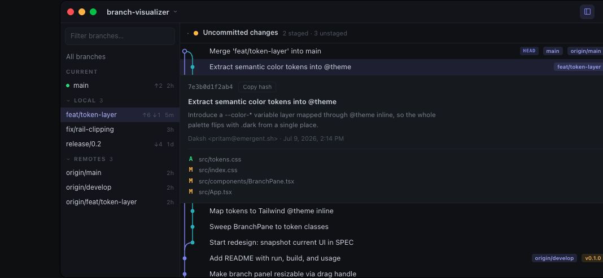

# Branch Visualizer

A macOS menu bar app that keeps your git branches, worktrees, commit graph, and working tree one click or hotkey away. Built with Tauri v2, React, TypeScript, and Tailwind. See [SPEC.md](SPEC.md) for the full product/architecture spec.

 (Windows/Linux planned — the codebase is structured for it)



The screenshot shows the core flow: filter branches on the left, inspect the colored commit graph on the right, open commit details inline, and handle uncommitted changes without leaving the menu bar popover.

## Requirements

- macOS
- [git](https://git-scm.com) on your PATH (the app shells out to your system git, so your existing SSH keys and credential helpers just work)
- To build from source: [Rust](https://rustup.rs) (stable) and [Bun](https://bun.sh)

## Install

```sh
brew install wannabeepolymath/tap/branch-visualizer
```

Homebrew compiles the app on your machine (first install takes a few minutes), so there's no Gatekeeper prompt and no code-signing requirement. Afterwards, link it into `/Applications` so Spotlight and Login Items can find it:

```sh
ln -sf "$(brew --prefix branch-visualizer)/Branch Visualizer.app" /Applications
```

Upgrades come through `brew upgrade` as usual.

Because it compiles on your machine, Homebrew requires reasonably current Xcode Command Line Tools (its requirement, not a version this app pins). If the install fails with `Error: Your Command Line Tools are too outdated`, update them via System Settings → Software Update — or if no update shows:

```sh
sudo rm -rf /Library/Developer/CommandLineTools
sudo xcode-select --install
```

then re-run the install.

> Downloading a prebuilt `.app`/`.dmg` from someone else instead? macOS quarantines downloaded unsigned apps ("app is damaged"). Clear it with `xattr -d com.apple.quarantine "/Applications/Branch Visualizer.app"`, or just build from source.

## Run from source

```sh
bun install        # once
bun run tauri dev  # compiles the Rust shell + starts Vite, launches the app
```

The first build compiles all Rust dependencies and takes a few minutes; subsequent runs are fast. Frontend changes hot-reload instantly; Rust changes trigger an automatic rebuild + relaunch.

## Build a release app

```sh
bun run tauri build
```

The `.app` bundle and `.dmg` land in `src-tauri/target/release/bundle/`. (Prebuilt distribution outside your machine needs code signing/notarization — install via Homebrew instead, which builds locally.)

## Using the app

The app lives in the **menu bar only** — no Dock icon, no regular window. Open it from the menu bar icon or the global shortcut, then work directly inside the popover.

- **Open/close the popover:** click the menu bar icon, or press **⌥⇧G** (configurable). It closes automatically when it loses focus.
- **Add a repository:** click the repo name (top-left) → *Add repository…*, or use the button on the empty state / in Settings. Pick any folder inside a git working tree.
- **Switch repositories:** repo dropdown, top-left.

### Feature walkthrough

- **Branches:** filter Current / Local / Remotes, see ahead/behind counts and last-commit ages, click a branch to focus the graph, or Cmd/Ctrl-click to compare multiple refs.
- **Branch actions:** right-click for Checkout, New branch from here…, Publish / Push / Force push…, Rename…, Delete…, and Copy name. Safe delete uses `git branch -d` first and asks before escalating to `-D`.
- **Worktrees:** when a repo has linked worktrees, switch the left pane from Branches to Worktrees, focus a worktree, see dirty/locked/prunable state, and open it with your configured editor or terminal command.
- **Commit graph:** scan a colored-lane DAG with branch/tag pills, short hashes, authorship age, merge/fork connectors, and paginated loading as you scroll.
- **Commit details and diffs:** click a commit to expand the full message, author/date, changed files, and per-file diffs; copy the full hash from the detail panel.
- **Uncommitted changes:** staged and unstaged changes appear above the graph, with inline diffs plus Stage, Unstage, Stage all, Unstage all, and guarded Discard actions.
- **Header actions:** Fetch runs `git fetch --all --prune`; Pull runs `git pull --ff-only` in the focused worktree.
- **Live refresh:** commits, checkouts, fetches, and repo changes from outside the app refresh automatically through a `.git` watcher.

### All features

- Menu-bar-only macOS app with no Dock icon.
- Tray icon toggle plus configurable global shortcut.
- Popover closes on blur and can be reset to its default size/position.
- Repository picker, add-repository flow, active-repo switching, and repository removal from Settings.
- Registered repositories persisted in the app config directory.
- Collapsible, resizable branch panel with remembered visibility and width.
- Branch search/filter.
- Branch groups for Current, Local, and Remotes.
- Optional remote-branch visibility by default.
- Ahead/behind counters and relative last-commit ages.
- Multi-ref graph filtering with Cmd/Ctrl-click.
- Branch context menu: checkout, create branch from ref, publish, push, force push, rename, delete, force delete after safe-delete refusal, and copy name.
- Worktrees tab appears when multiple worktrees exist.
- Worktree focus routes branch checkout, pull, status, staging, and discard actions to that worktree.
- Worktree rows show branch or detached HEAD, main-worktree label, dirty state, locked state, prunable state, and ahead/behind counts.
- One-click worktree open button plus right-click "Open in…" menu.
- Custom worktree open targets with `{path}` substitution and configurable default target.
- Virtualized commit graph for large histories.
- Colored graph lanes with merge/fork connectors.
- Theme-aware graph styling, including Terminal's square-node TUI style.
- Branch and tag pills on commit rows, with overflow popover for extra refs.
- Short hashes, relative commit ages, and truncated commit subjects with titles.
- Scroll-to-load commit pagination with configurable page size from 50 to 1000.
- Empty, loading, and loading-more graph states.
- Commit expansion with full subject/body, author email, local date/time, changed files, and copy-hash button.
- Per-file commit diff expansion, including loading, empty, and truncation states.
- Commit context menu: copy hash, copy message, create branch here, and checkout detached.
- Pinned uncommitted-changes panel shown only when the focused worktree is dirty.
- Staged and unstaged file sections with counts.
- Stage, unstage, stage all, unstage all, mark-conflict-resolved, discard tracked changes, and discard untracked files.
- Inline working-tree and staged diffs for changed files.
- Confirmation ticks for codebase-affecting file actions when enabled; destructive discard always confirms.
- Fetch all remotes with prune.
- Fast-forward-only pull.
- Toast feedback for successful actions and git errors.
- Automatic refresh from `.git` filesystem watching.
- Launch-at-login toggle.
- Six built-in themes: Midnight, Obsidian, Onyx, Carbon, Terminal, and Paper.
- Settings sections are collapsible and remember their open/closed state.
- Read-only command reference showing the git command behind each UI action.
- Typed React-to-Tauri IPC boundary.
- Platform-specific code isolated for cheaper Windows/Linux ports later.

### Settings

- Manage repositories, launch-at-login, action confirmations, and the global shortcut.
- Choose from six visual themes: Midnight, Obsidian, Onyx, Carbon, Terminal, and Paper.
- Configure commits per page, remote branch visibility, and custom Worktree "open with…" commands.
- Review the git commands each UI action runs.

Settings are stored in `~/Library/Application Support/com.branchvisualizer.app/settings.json`.

## Development

```sh
bunx tsc --noEmit             # typecheck frontend
bun src/lib/graph.check.ts    # graph lane-layout self-checks
cd src-tauri && cargo check   # compile-check Rust
cd src-tauri && cargo test    # git output parser tests
```

Layout: `src/` is the React UI (all platform-agnostic; talks to the backend only through the typed IPC wrappers in `src/lib/ipc.ts`), `src-tauri/src/` is the Rust shell — `git.rs` (run/parse git), `state.rs` (settings), `watcher.rs` (live refresh), `commands.rs` (IPC surface), and `platform.rs`, the **only** file with OS-specific code, which is what will make the Windows/Linux ports cheap.
