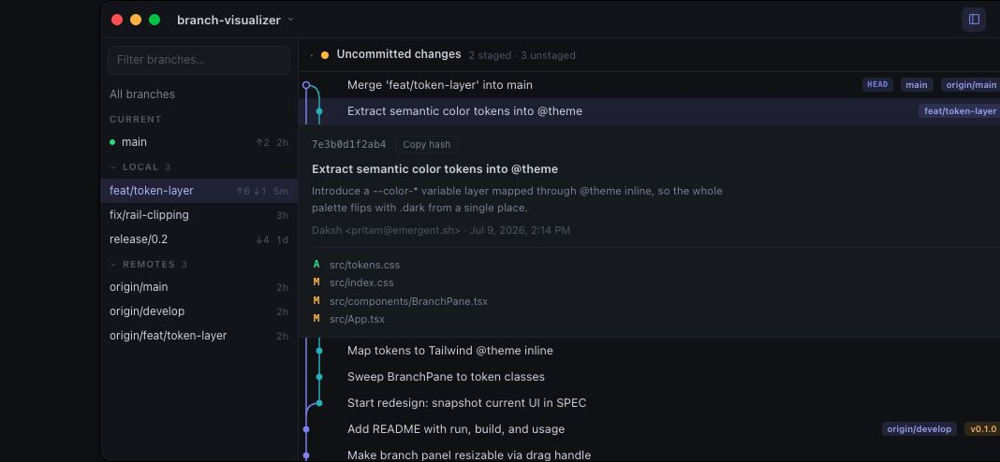

# Branch Visualizer

A macOS menu bar app that keeps your git branches, worktrees, commit graph, and working tree one click or hotkey away. It also runs on Linux in beta, where it is a regular desktop window by default rather than a menu-bar popover. Built with Tauri v2, React, TypeScript, and Tailwind. See [SPEC.md](SPEC.md) for the full product/architecture spec.

 (Windows planned — a separate port, not a recompile)



The screenshot shows the core flow: filter branches on the left, inspect the colored commit graph on the right, open commit details inline, and handle uncommitted changes without leaving the menu bar popover.

## Requirements

- macOS, or Linux on x86_64 ([beta](#linux-beta))
- [git](https://git-scm.com) on your PATH (the app shells out to your system git, so your existing SSH keys and credential helpers just work)
- To build from source: [Rust](https://rustup.rs) (stable) and [Bun](https://bun.sh)

## Install

### macOS

```sh
brew install wannabeepolymath/tap/branch-visualizer
```

Homebrew compiles the app on your machine (first install takes a few minutes), so there's no Gatekeeper prompt and no code-signing requirement. Afterwards, link it into `/Applications` so Spotlight and Login Items can find it:

```sh
ln -sf "$(brew --prefix branch-visualizer)/Branch Visualizer.app" /Applications
```

Upgrades come through `brew upgrade` as usual.

Because it compiles on your machine, Homebrew requires reasonably current Xcode Command Line Tools (its requirement, not a version this app pins). If the install fails with `Error: Your Command Line Tools are too outdated`, update them via System Settings → Software Update — or if no update shows:

```sh
sudo rm -rf /Library/Developer/CommandLineTools
sudo xcode-select --install
```

then re-run the install.

> Downloading a prebuilt `.app`/`.dmg` from someone else instead? macOS quarantines downloaded unsigned apps ("app is damaged"). Clear it with `xattr -dr com.apple.quarantine "/Applications/Branch Visualizer.app"` (recursive — the flag lands on files inside the bundle too), or just build from source.

### Linux (beta)

Grab a `.deb`, `.rpm`, or `.AppImage` from the [latest release](https://github.com/wannabeepolymath/git-branch-Visualizer/releases/latest). x86_64 only for the beta.

**deb and rpm are the recommended install.** They register a `.desktop` entry, so the app appears in your applications menu — which is the primary way to open it on Linux, where the tray is optional and the global shortcut may not work at all (see below).

```sh
sudo dpkg -i branch-visualizer_*_amd64.deb    # Debian, Ubuntu
sudo rpm -i branch-visualizer-*.x86_64.rpm    # Fedora, RHEL, openSUSE
```

The AppImage is the distro-agnostic fallback: `chmod +x` it and run it. It installs **no** `.desktop` entry, so it will not show up in your applications menu on its own — use [AppImageLauncher](https://github.com/TheAssassin/AppImageLauncher) or write a `.desktop` file by hand if you want a launcher icon.

Runtime libraries you may need to install first (the deb and rpm declare them; the AppImage does not):

```sh
sudo apt install libwebkit2gtk-4.1-0 libayatana-appindicator3-1   # Debian, Ubuntu
sudo dnf install webkit2gtk4.1 libayatana-appindicator-gtk3       # Fedora
```

**Known limitations.** The Linux build is beta: it is produced by CI and has not been tested on real Linux hardware, because nobody on this project owns a Linux machine. It compiles, it bundles, and that is the extent of what has been verified. Bug reports are the only way this gets better — please file them.

- **No global shortcut on Wayland.** The `global-hotkey` crate is X11-only, and Wayland is the default session on current Ubuntu, Fedora, GNOME, and KDE Plasma. Under Wayland the shortcut recorder in Settings disables itself and says so, rather than registering a hotkey that silently never fires. Under X11 the shortcut works and defaults to **Ctrl+Shift+G**.
- **Clicking the tray icon does nothing.** That is by design, not a bug: `tray-icon` emits no click events on Linux. The tray is a **menu** — right-click (or left-click, depending on your desktop) for Show, Settings, Check for updates, and Quit.
- **GNOME has shipped without a system tray since 3.26.** Tray mode needs the AppIndicator extension. Ubuntu bundles it; stock Fedora and Debian GNOME do not, and there the tray icon simply never appears. This is exactly why the default on Linux is a regular window and not a tray popover — a `.desktop` entry works on every desktop, tray or no tray, X11 or Wayland.
- **No rounded corners.** The rounded popover is macOS-only; Linux windows are square.

## Run from source

```sh
bun install        # once
bun run tauri dev  # compiles the Rust shell + starts Vite, launches the app
```

The first build compiles all Rust dependencies and takes a few minutes; subsequent runs are fast. Frontend changes hot-reload instantly; Rust changes trigger an automatic rebuild + relaunch.

## Build a release app

```sh
bun run tauri build
```

On macOS the `.app` bundle and `.dmg` land in `src-tauri/target/release/bundle/`. Both are built for the host architecture only and are adhoc-signed, so they run on the machine that built them but fail Gatekeeper anywhere else. Prebuilt distribution needs a Developer ID certificate and notarization; until then, Homebrew building locally is the distribution path.

On Linux the same command writes `.deb`, `.rpm`, and `.AppImage` to that directory. Building needs `libwebkit2gtk-4.1-dev`, `libayatana-appindicator3-dev`, `librsvg2-dev`, `libgtk-3-dev`, `libssl-dev`, and `build-essential`.

## Releasing (and how updates reach users)

Settings → **Updates** checks `releases/latest/download/latest.json` on this repo, downloads the signed artifact for your platform (the `.app.tar.gz` on macOS), installs it, and offers a restart. The updater verifies its own minisign signature, so an unsigned build still updates safely — but the app must be writable where it sits (a Homebrew-installed copy gets overwritten under the brew prefix, which `brew upgrade` will then rebuild over).

It is one button everywhere, but four install mechanisms sit behind it — the shipped binary knows which format it was bundled as:

| Format | How it updates | What you see |
| --- | --- | --- |
| macOS `.app` | bundle swapped in place | nothing |
| AppImage | file swapped in place | nothing |
| deb | `pkexec dpkg -i` | a polkit password prompt |
| rpm | `pkexec rpm -U` | a polkit password prompt |

Publishing a release is one push:

```sh
git tag v1.0.3 && git push origin v1.0.3
```

`.github/workflows/release.yml` builds a macOS universal binary plus the Linux x86_64 bundles, signs them, and uploads the artifacts plus `latest.json`. The Linux leg pins `ubuntu-22.04` rather than `ubuntu-latest` on purpose: linking against 24.04's glibc produces a binary that will not start on older distros. It needs one repo secret, `TAURI_SIGNING_PRIVATE_KEY` — the contents of the minisign private key whose public half is `plugins.updater.pubkey` in `tauri.conf.json`. Lose that key and no future build can produce an update the shipped app will accept.

## Using the app

On macOS the app lives in the **menu bar only** — no Dock icon, no regular window. Open it from the menu bar icon or the global shortcut, then work directly inside the popover.

- **Open/close the popover:** click the menu bar icon, or press **⌥⇧G** (configurable). It closes automatically when it loses focus.
- **Add a repository:** click the repo name (top-left) → *Add repository…*, or use the button on the empty state / in Settings. Pick any folder inside a git working tree.
- **Switch repositories:** repo dropdown, top-left.

### Window mode (Linux)

On Linux the app opens as an **ordinary desktop window** by default: decorated, in the taskbar, position remembered, and the titlebar close button quits the app. Launch it from your applications menu.

Settings has a **Window mode** row that switches it to **popover** — undecorated, always on top, hidden from the taskbar, hides when it loses focus — if your desktop has a working tray and you prefer the macOS behaviour. It centres on screen rather than anchoring under the tray icon, since there is no tray position to anchor to. The switch takes effect immediately; there is no restart. Window is the default because it is the one mode that is reachable on every desktop, tray or no tray, X11 or Wayland.

This row does not exist on macOS, where the app is always a popover.

### Feature walkthrough

- **Branches:** filter Current / Local / Remotes, see ahead/behind counts and last-commit ages, click a branch to focus the graph, or Cmd/Ctrl-click to compare multiple refs.
- **Branch actions:** right-click for Checkout, New branch from here…, Publish / Push / Force push…, Rename…, Delete…, and Copy name. Safe delete uses `git branch -d` first and asks before escalating to `-D`.
- **Worktrees:** when a repo has linked worktrees, switch the left pane from Branches to Worktrees, focus a worktree, see dirty/locked/prunable state, and open it with your configured editor or terminal command.
- **Commit graph:** scan a colored-lane DAG with branch/tag pills, short hashes, authorship age, merge/fork connectors, and paginated loading as you scroll.
- **Commit details and diffs:** click a commit to expand the full message, author/date, changed files, and per-file diffs; copy the full hash from the detail panel.
- **Uncommitted changes:** staged and unstaged changes appear above the graph, with inline diffs plus Stage, Unstage, Stage all, Unstage all, and guarded Discard actions.
- **Header actions:** Fetch runs `git fetch --all --prune`; Pull runs `git pull --ff-only` in the focused worktree.
- **Live refresh:** commits, checkouts, fetches, and repo changes from outside the app refresh automatically through a `.git` watcher.

### All features

- Menu-bar-only on macOS with no Dock icon, registered as an accessory before launch so no icon ever flashes.
- On Linux, a regular decorated window by default, with an opt-in tray-popover mode in Settings.
- Rounded popover with a native drop shadow, drawn on a transparent window rather than a plain rectangle (macOS; square on Linux).
- Tray icon toggle on macOS; a tray menu (Show / Settings / Check for updates / Quit) on Linux, where tray click events do not exist.
- Configurable global shortcut, disabled with an explanation under Wayland.
- Popover closes on blur and can be reset to its default size/position.
- Repository picker, add-repository flow, active-repo switching, and repository removal from Settings.
- Registered repositories persisted in the app config directory.
- Collapsible, resizable branch panel with remembered visibility and width.
- Branch search/filter.
- Branch groups for Current, Local, and Remotes.
- Optional remote-branch visibility by default.
- Ahead/behind counters and relative last-commit ages.
- Multi-ref graph filtering with Cmd/Ctrl-click.
- Branch context menu: checkout, create branch from ref, publish, push, force push, rename, delete, force delete after safe-delete refusal, and copy name.
- Worktrees tab appears when multiple worktrees exist.
- Worktree focus routes branch checkout, pull, status, staging, and discard actions to that worktree.
- Worktree rows show branch or detached HEAD, main-worktree label, dirty state, locked state, prunable state, and ahead/behind counts.
- One-click worktree open button plus right-click "Open in…" menu.
- Custom worktree open targets with `{path}` substitution and configurable default target.
- Virtualized commit graph for large histories.
- Colored graph lanes with merge/fork connectors.
- Theme-aware graph styling, including Terminal's square-node TUI style.
- Branch and tag pills on commit rows, with overflow popover for extra refs.
- Short hashes, relative commit ages, and truncated commit subjects with titles.
- Scroll-to-load commit pagination with configurable page size from 50 to 1000.
- Empty, loading, and loading-more graph states.
- Commit expansion with full subject/body, author email, local date/time, changed files, and copy-hash button.
- Per-file commit diff expansion, including loading, empty, and truncation states.
- Commit context menu: copy hash, copy message, create branch here, and checkout detached.
- Pinned uncommitted-changes panel shown only when the focused worktree is dirty.
- Staged and unstaged file sections with counts.
- Stage, unstage, stage all, unstage all, mark-conflict-resolved, discard tracked changes, and discard untracked files.
- Inline working-tree and staged diffs for changed files.
- Confirmation ticks for codebase-affecting file actions when enabled; destructive discard always confirms.
- Fetch all remotes with prune.
- Fast-forward-only pull.
- Toast feedback for successful actions and git errors.
- Automatic refresh from `.git` filesystem watching.
- Launch-at-login toggle.
- Six built-in themes: Midnight, Obsidian, Onyx, Carbon, Terminal, and Paper.
- Settings sections are collapsible and remember their open/closed state.
- Read-only command reference showing the git command behind each UI action.
- Typed React-to-Tauri IPC boundary.
- In-app updater on macOS and all three Linux package formats.
- Platform-specific code isolated in one file for a cheaper Windows port later.

### Settings

- Manage repositories, launch-at-login, action confirmations, and the global shortcut.
- Choose from six visual themes: Midnight, Obsidian, Onyx, Carbon, Terminal, and Paper.
- Configure commits per page, remote branch visibility, and custom Worktree "open with…" commands.
- Switch between window and popover mode (Linux only).
- Review the git commands each UI action runs.

Settings are stored in `~/Library/Application Support/com.branchvisualizer.app/settings.json` on macOS, and `~/.config/com.branchvisualizer.app/settings.json` on Linux.

## Development

```sh
bunx tsc --noEmit             # typecheck frontend
bun src/lib/graph.check.ts    # graph lane-layout self-checks
cd src-tauri && cargo check   # compile-check Rust
cd src-tauri && cargo test    # git output parsing, settings migration, open-target expansion
```

Layout: `src/` is the React UI (talks to the backend only through the typed IPC wrappers in `src/lib/ipc.ts`), `src-tauri/src/` is the Rust shell — `git.rs` (run/parse git), `state.rs` (settings), `watcher.rs` (live refresh), `commands.rs` (IPC surface), and `platform.rs`, which holds essentially all the OS-specific code behind `#[cfg]` blocks: `hide_from_dock`, `make_tray_template`, `default_toggle_shortcut`, plus `build_tray` (click-to-toggle on macOS, a menu on Linux), `anchor_window` (tray-anchored on macOS, centred on Linux), and `shortcut_supported` (false under Wayland). Keeping it in one file is what should make the Windows port cheap.

Two things sit outside it. `src-tauri/Info.plist` (`LSUIElement`) is bundled only on macOS. And `tauri.conf.json`'s `macOSPrivateApi` + `transparent` keys are not per-platform, so the window is created transparent everywhere; on Linux without a compositor that would paint black corners, so the fix is in CSS — `[data-platform="linux"] #root` drops to `border-radius: 0` and the opaque root fills the frame. The frontend learns which platform it is on from a `get_platform_info` command at startup, which also carries `shortcutSupported`.
